<h1 align="center">Olá, eu sou o Elias 👋</h1>
<h3 align="center">Desenvolvedor Backend & Fullstack · Backend & Fullstack Developer</h3>

  
  
  

---

### 🇧🇷 Sobre mim

Desenvolvedor com foco em **backend** e paixão por construir sistemas reais — não protótipos de gaveta, mas aplicações que rodam e atendem usuários de verdade.

- 🚀 Tenho um **e-commerce em produção** que construí do banco de dados ao deploy, com domínio próprio e clientes reais → [lojaraiodeluz.com.br](https://www.lojaraiodeluz.com.br)
- 🏥 Atuei em projeto institucional para o **Hospital Laureano** num time ágil de 8 pessoas, onde fui reconhecido como **Squad Leader**
- 🎓 **Tecnólogo em Sistemas para Internet** pelo Unipê (concluído em 2026)
- 💬 Inglês avançado · aberto a oportunidades remotas ou presenciais

### 🇺🇸 About me

Backend-focused developer passionate about building **real systems** — not drawer prototypes, but applications that run and serve real users.

- 🚀 I have an **e-commerce store in production** that I built end-to-end, on a custom domain with real customers → [lojaraiodeluz.com.br](https://www.lojaraiodeluz.com.br)
- 🏥 I worked on an institutional project for **Hospital Laureano** in an 8-person agile team, where I was recognized as **Squad Leader**
- 🎓 **Technologist in Internet Systems** from Unipê (completed 2026)
- 💬 Advanced English · open to remote or on-site opportunities

---

### 🛠️ Tecnologias · Tech Stack

**Backend**

**Frontend**

**Banco de Dados & Infra · Database & Infra**

---

### 🔦 Projetos em destaque · Featured Projects

| Projeto | Descrição | Stack |
|---------|-----------|-------|
| 🛍️ **[Raio de Luz](https://www.lojaraiodeluz.com.br)** | E-commerce de moda feminina · **em produção** | Backend · PostgreSQL · Docker |
| 🚚 **[DragonFleet](https://github.com/eliasneto072/DragonFleet)** | Gestão de frotas e motoristas (fullstack) | React · Node · Prisma · JWT |
| 💬 **[AeroForum](https://github.com/eliasneto072/forum)** | Fórum de discussão em Django | Python · Django · PostgreSQL |
| 🛒 **[Brás Conecta](https://github.com/eliasneto072/Bras-conecta)** | Marketplace atacadista B2B | Node · TypeScript · Zod |

---

### 📊 GitHub Stats

  

  

---

  
  &nbsp;
  

<i>💡 "Construo sistemas que chegam ao mundo real."</i>

